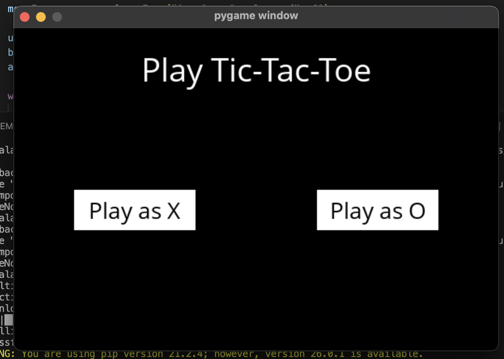
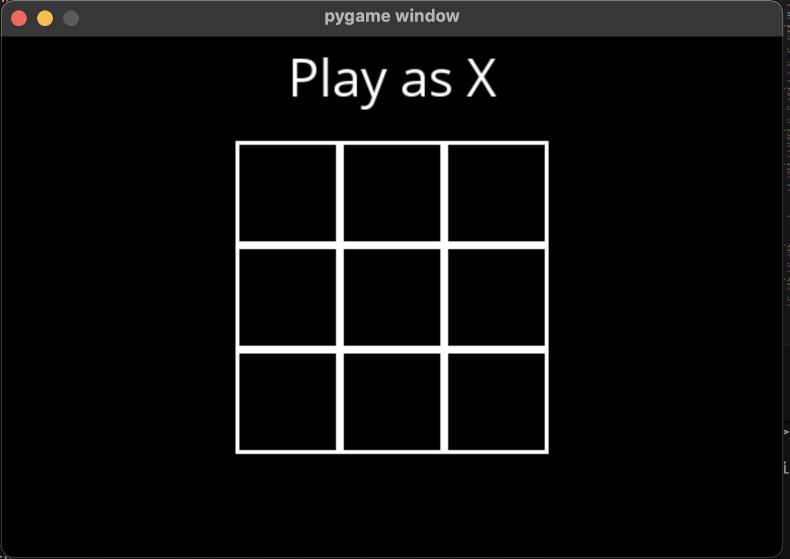
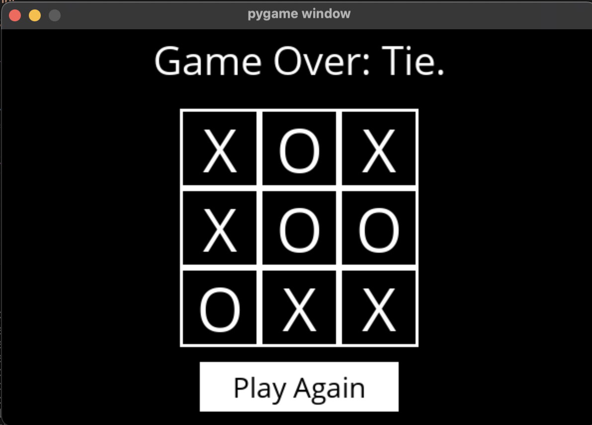
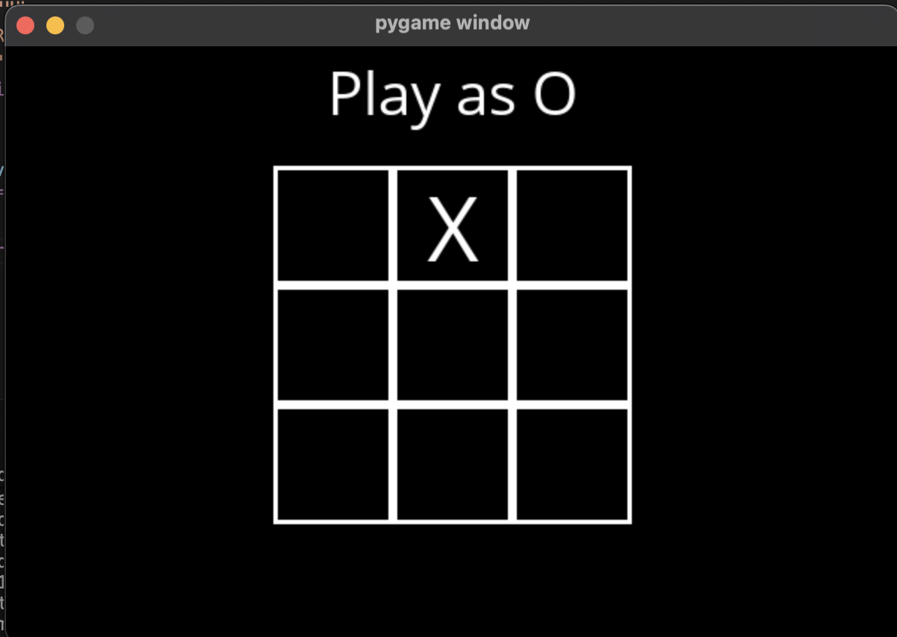
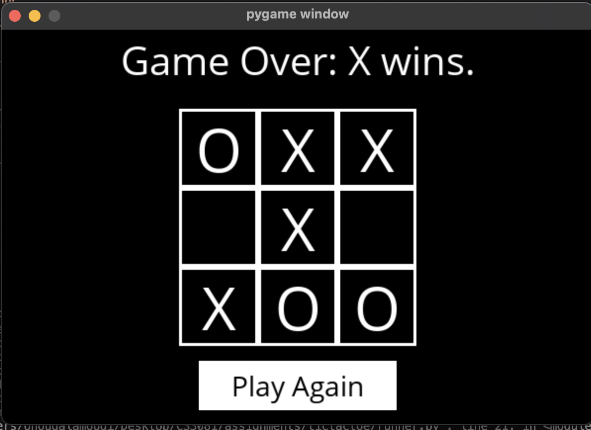

# CS3081-Assignment1
# Tic Tac Toe AI Using The MiniMax Algorithm
# Name: ohoud alamoudi
# Student id: S24109009

# Description

This is my assignment 1 for CS3081. In this assignment I used the given tic tac toe AI code using the Minimax algorithm. The goal was to make the AI play optimally so that it wont be won by a human and try to make the best result a human can get is a tie

# Implementation approach

I completed the required functions in the provided code to build a tic tac toe ai using the Minimax algorithm. First I implemented the basic game functions such as determining the current player and after checking available moves then updating the board safely using deep copy and finally detecting a winner and checking if the game is over. Then, I implemented the Minimax algorithm and this algorithm explores all possible future game states and chooses the best move X acts as the maximizing player and O acts as the minimizing player, this ensures that the AI always plays optimally.

# Challenges and their solutions

challenge 1: understanding how the minimax recursion works, in the beggening it was confusing because it checks future moves using recursion and I solved this by breaking the logic into smaller functions for the maximizing and minimizing players

challenge 2: making sure the original board insid the result function was not modified and I solved this by using the copy.deepcopy() function to create a new board before making changes.

# Screenshots 

# Game Start Screen

This screen shows the main menu where the player can choose to play as X or O

# Playing as X

This screenshot shows the game board after selecting Play as X

# Tie

This screenshot shows a tie game and the final result is a draw

# Playing as O

This screenshot shows the game after selecting Play as O and the AI plays first as X 

# X wins (AI)

This screenshot shows the final board state where X wins on O and the win configuration is shown with a Play Again button

